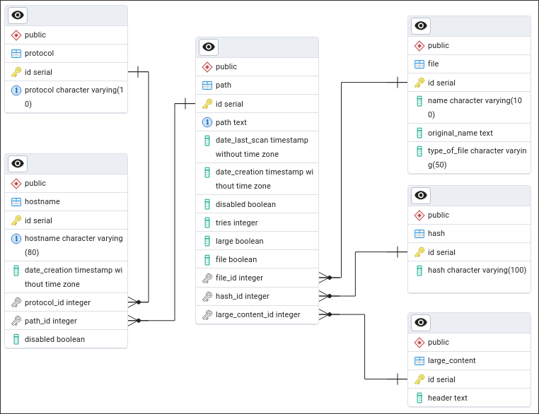

# SQL Database

After much tough I arrived to a conclusion of how I was going to build my DB. 
- The `hostname` table will contain a hostname.

Ex. hostname -> `torlinksge6enmcyyuxjpjkoouw4oorgdgeo7ftnq3zodj7g2zxi3kyd.onion 

- The `hostname` owns a `protocol`. So I created the `protocol` table and the 
`hostname` table has the foreign key for the `protocol` table.

Ex. protocol -> `https`

- The `hostname` also owns a `path`. So I created the `path` table. (Same logic 
as the last point)

Ex. path -> `/some/path`

- The `path` can own a `file`. So I created the `file` table.

Ex. file -> `foo.txt`

- The `path` can have `large_content`. So I created the `large_content` table.

Ex. large_content -> `large_content.txt`

Also in each table, I will be recording the data of creation and some other info
about the table itself.

Here is the schema of the database that was created:

